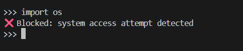
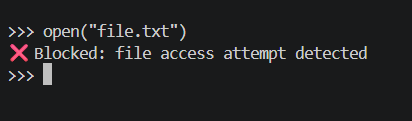
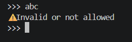
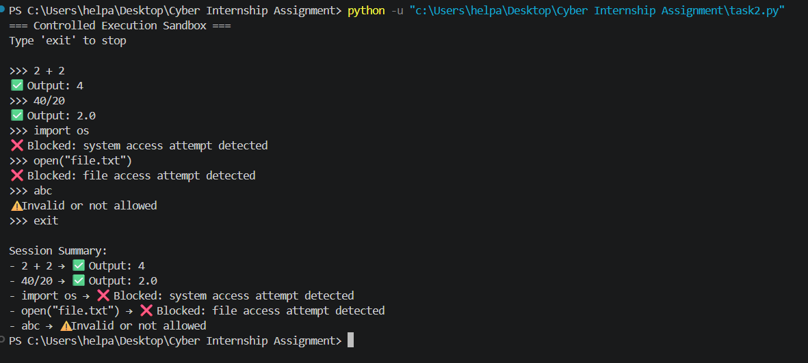

# controlled-execution-sandbox

## Overview
Python-based restricted execution sandbox with basic threat detection and input validation.

## Features
- Threat categorization
- Restricted command execution
- Input validation
- Basic attack detection
- Session logging

## Technologies Used
- Python

## Cybersecurity Concepts
- Sandboxing
- Input sanitization
- Threat detection
- Secure execution environments

## Future Improvements
- Regex-based filtering
- Advanced command parsing
- Real-time monitoring
- Logging integration

 ## Screenshots
 ### Safe Execution of Input
 

 ### Blocking System Access Attempt
 

 ### Blocking File Access Attempt
 

 ### Hnadling Invalid Input
 

 ### Session Summary
 

